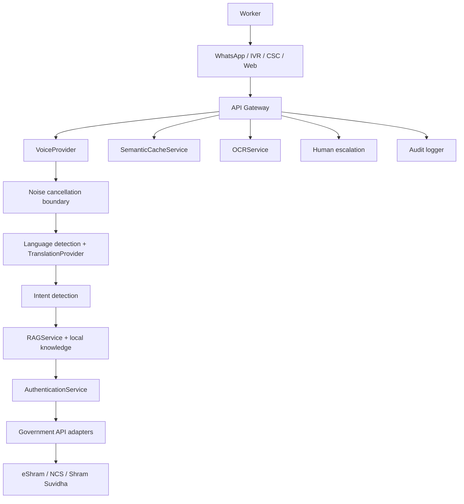

# Shram Saathi

> **Har Mazdoor Ka Adhikar, Ab Awaaz Mein.**

Shram Saathi is a voice-first accessibility layer for workers navigating labour services. It helps people who face low literacy, regional-language, connectivity, biometric and digital-confidence barriers by connecting them to familiar channels and existing systems.

This repository contains a **hackathon prototype**. Government integrations, authentication, voice providers, metrics and worker records are simulated. It is not officially connected to eShram, NCS, Shram Suvidha or any other government system.

## What the prototype demonstrates

- A worker-first welcome experience with large, high-contrast controls
- A voice assistant flow in Hindi with a 60-second guided demo
- Regional language selection with an extensible language model
- Mock eShram, NCS and Shram Suvidha API adapters
- Government-document-grounded RAG fallback behavior
- In-memory semantic cache with a Qdrant-ready boundary
- Three-layer authentication simulation: voice, camera and OTP
- Human / CSC VLE handoff for confusion or distress
- A judge dashboard labeled `Demo / Simulated Data`
- An architecture view explaining the middleware boundary
- Responsive behavior, keyboard focus states and reduced-motion support

## Run it

```bash
npm install
cp .env.example .env
npm run dev
```

Open `http://localhost:5173`. The API runs on `http://localhost:8787`.

## Deploy to Vercel

The repository includes `vercel.json` and a serverless API entrypoint at `api/index.js`.

```bash
npx vercel login
npx vercel --prod
```

Alternatively, import the repository in the Vercel dashboard. Use the default Vite build settings; the configured build command is `npm run build` and the output directory is `dist`. No environment variables are required for demo mode.

Quality checks:

```bash
npm run lint
npm test
npm run build
```

## Product journey

1. Worker arrives through WhatsApp, toll-free IVR, CSC kiosk or web voice.
2. Voice is captured, language is detected and intent is identified.
3. The local knowledge base supplies grounded guidance.
4. The worker can complete a simulated government service.
5. Authentication layers and sensitive-data masking are shown clearly.
6. A human can join when the worker is confused or distressed.

The primary demo scenario is: `Mujhe eShram mein registration karna hai.` It ends with `DEMO-ESHRAM-2026-001` and is explicitly marked as demo data.

## Architecture



The code keeps provider seams explicit in `src/services/contracts.ts`. Mock implementations work without credentials. BHASHINI, Sarvam, IndicTrans2/3, Qdrant, OpenCV/CRAFT/Tesseract and production authentication providers can be added behind those interfaces.

## API surface

| Method | Endpoint | Purpose |
|---|---|---|
| GET | `/api/health` | Gateway health |
| POST | `/api/voice/session` | Create a demo voice session |
| POST | `/api/voice/process` | Detect language and intent |
| POST | `/api/translate` | Translation provider boundary |
| POST | `/api/rag/query` | Grounded knowledge response |
| POST | `/api/auth/:layer` | Voice, camera or OTP simulation |
| POST | `/api/eshram/register` | Mock eShram registration |
| GET | `/api/eshram/status` | Mock registration status |
| GET | `/api/ncs/jobs` | Mock job opportunities |
| GET | `/api/shram-suvidha/services` | Mock service catalogue |
| POST | `/api/human/escalate` | Create a mock handoff queue item |
| GET | `/api/dashboard/stats` | Simulated judge metrics |

## Security and privacy

- No real Aadhaar, worker records or secrets belong in this repository.
- UI examples always use the masked value `XXXX-XXXX-1234`.
- `.env` is ignored; `.env.example` documents non-secret configuration.
- The production boundary is designed for TLS 1.3, AES-256-GCM, rate limiting, input validation, role-based authorization and audit logging.
- Authentication in this repository is a simulation and is not a biometric or security certification.
- Production use requires threat modeling, independent testing, consent, retention controls, provider agreements and applicable government approvals.

## Accessibility

The prototype uses large touch targets, visible focus styles, semantic buttons, `aria-label` text for microphone/menu controls, simple language, status feedback, strong contrast and a reduced-motion media query. The voice path is the primary interaction, but every demo action also has a visible control for keyboard and assisted use.

## Repository structure

```text
src/App.tsx                 Worker and judge screens
src/styles.css              Responsive visual system
src/services/contracts.ts   Provider and integration contracts
server/index.js             Express mock API gateway
data/knowledge.json         Local, prototype-only knowledge base
.env.example                Safe configuration template
```

## Limitations and roadmap

Current work is a judge-ready prototype, not a production service. Voice transcription, OCR, translation, sentiment detection, cache similarity, authentication and government calls are mocked. Next steps are provider-backed voice with consent, offline queues, verified document ingestion, real accessibility testing with workers, threat modeling, observability, and formal compliance review.

## Hackathon positioning

The differentiator is not another worker database. Shram Saathi is an inclusive middleware layer designed to make existing labour systems usable through voice, regional languages, low-connectivity paths and human assistance, while keeping the limits of a prototype visible.
